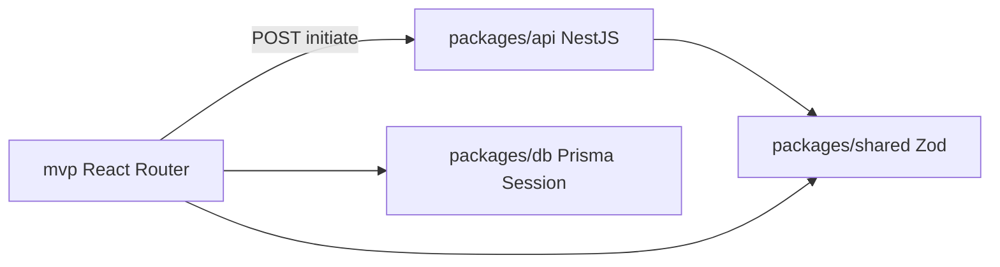

# Phase 0 — Completion Record

## At a glance

| Field | Value |
|-------|-------|
| Phase | 0 — Foundation & QA Harness |
| Completed | 2025-06-21 |
| Milestone | M0 — Quality harness |
| PRD items closed | PRD-002, PRD-003, PRD-046 (stub), PRD-056 |
| Sign-off | [phase-0-signoff.md](../qa/phase-0-signoff.md) |

## Process summary

Scaffolded npm workspaces monorepo with `mvp/` (embedded UI), `packages/{shared,db,api,workers}`, unified style presets, NestJS 11 initiate stub, PostgreSQL Prisma schema, docker-compose for Postgres 17 and Redis 7, Vitest/Playwright/CI, and full QA documentation structure.

## Key decisions

| Decision | Rationale | Alternatives considered |
|----------|-----------|-------------------------|
| PostgreSQL in `packages/db` | PRD job tables + scale | Keep SQLite (rejected) |
| NestJS 11 for API | PRD split architecture | Express-only stub (rejected) |
| `prd-progress.md` mirror | Auditable PRD tracking without editing prd.md | Edit prd.md inline (rejected) |
| Vite alias to shared source | Faster dev without pre-build | Build shared on every dev (deferred) |

## Outcomes

- `POST /api/projects/initiate` returns 202 with UUID (stub)
- Style presets aligned across UI, API Zod schema, and AI service
- Unit + integration + E2E harness passing in CI
- `docs/qa/` and `docs/phases/` established

## Deviations and deferred items

See [phase-0-discrepancies.md](../qa/phase-0-discrepancies.md) — ESLint 9, React 19, full E2E with OAuth deferred.

## Readiness for Phase 1

- Monorepo and CI stable
- Shared Zod contracts for project APIs
- PostgreSQL schema location defined; Phase 1 adds PRD tables
- API stub ready to persist `design_projects` and `project_jobs`

---

## Developer guide — Phase 0

### Prerequisites and setup

- Node.js **22.12+**
- Copy `.env.example` → `.env` (repo root and `mvp/.env` for Shopify CLI)
- `npm ci` from repository root
- `docker compose up -d` for Postgres and Redis
- `npm run db:generate && npm run db:migrate`
- `npm run dev:api` (port 3001) and `npm run dev:mvp` (Shopify CLI)

### Repository structure

```
/
├── mvp/                 # React Router embedded Shopify app
├── packages/
│   ├── shared/          # Presets, Zod contracts, JOB_TYPES
│   ├── db/              # Prisma + PostgreSQL Session model
│   ├── api/             # NestJS REST API
│   └── workers/         # Phase 4 placeholder
├── docs/qa/             # Gate checklists
├── docs/phases/         # Phase completion records
├── docker-compose.yml
└── package.json         # Workspace root
```

### Code architecture



### API contracts

**POST `/api/projects/initiate`** (202)

Request:

```json
{
  "productIds": ["gid://shopify/Product/1"],
  "stylePreset": "high-converting",
  "shop": "store.myshopify.com"
}
```

Response:

```json
{
  "projectId": "uuid",
  "status": "PENDING",
  "message": "Project initiation accepted (Phase 0 stub — persistence in Phase 1)"
}
```

Schemas: `packages/shared/src/contracts/projects.ts`

### Database changes

- `packages/db/prisma/schema.prisma` — `Session` model on PostgreSQL
- Migration: `packages/db/prisma/migrations/20250621000000_init_session/`

### Configuration reference

| Variable | Purpose |
|----------|---------|
| `DATABASE_URL` | PostgreSQL connection |
| `PROJECT_API_URL` | MVP → API base URL (default `http://localhost:3001`) |
| `API_PORT` | NestJS listen port |

### Testing

| Command | Coverage |
|---------|----------|
| `npm run test:unit` | Shared presets |
| `npm run test:integration` | API health + initiate |
| `npm run test:e2e` | Playwright harness |

### Extension guide

- Add Zod schemas in `packages/shared` before API/UI changes
- New NestJS modules under `packages/api/src/`
- Register Vite aliases in `mvp/vite.config.ts` for new workspace packages

### Known limitations

- Initiate does not persist projects (Phase 1)
- E2E does not cover OAuth install flow yet
- Workers package is a stub

### Troubleshooting

1. **API 502 from styles page** — ensure `npm run dev:api` is running
2. **Prisma errors** — run `docker compose up -d` and `npm run db:migrate`
3. **Module not found @theme-editor/shared** — run from repo root `npm ci`
