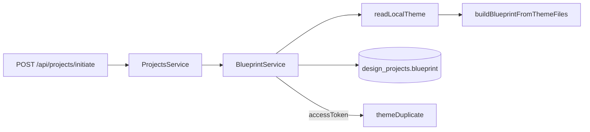

# Phase 2 — Completion Record

## At a glance

| Field | Value |
|-------|-------|
| Phase | 2 — Base Theme Blueprint Engine |
| Completed | 2025-06-21 |
| Milestone | M1 — Theme intelligence |
| PRD items closed | PRD-001, Blueprint Engine JSON contract |
| Sign-off | [phase-2-signoff.md](../qa/phase-2-signoff.md) |

## Process summary

Implemented a blueprint pipeline that reads the local Horizon Pro theme in `base theme/`, parses section and block `` definitions, extracts global settings/fonts/colors/CSS variables, and produces a Zod-validated `ThemeBlueprint` JSON. On project initiate, the API builds the blueprint, persists it to `design_projects.blueprint`, sets status `BLUEPRINT_READY`, and optionally duplicates the shop's main theme as a draft when an access token is provided.

## Key decisions

| Decision | Rationale | Alternatives considered |
|----------|-----------|-------------------------|
| Local folder as blueprint source | PRD "Base Theme First"; deterministic CI without Shopify OAuth | Fetch theme assets via Admin API (deferred) |
| Parse `` from `.liquid` | Matches Shopify theme structure | Separate JSON schema files (not used by themes) |
| `themeDuplicate` for draft | Native Shopify draft role; safe preview target | Create empty theme (rejected) |
| PRD retry 5s/10s/20s in shared `withRetry` | Reused by Shopify client and future workers | Per-call ad-hoc retries (rejected) |

## Outcomes

- `POST /api/projects/initiate` returns `blueprintSectionCount` and optional `draftThemeId`
- Blueprint: 167 sections, 130 blocks from Horizon Pro
- Unit test validates `editorial-hero` and rejects invented section types
- Migration `20250621130000_add_project_blueprint` adds `blueprint` JSON column

## Deviations and deferred items

See [phase-2-discrepancies.md](../qa/phase-2-discrepancies.md).

## Readiness for Phase 3

- `ThemeBlueprint` contract stable for AI agents to consume
- Project status `BLUEPRINT_READY` gates agent pipeline
- `JOB_TYPES` unchanged; Phase 3 fills agent outputs referencing blueprint

---

## Developer guide — Phase 2

### Prerequisites and setup

- `base theme/` must exist at repo root (Horizon Pro)
- Set `REPO_ROOT=.` and `BASE_THEME_PATH=./base theme` in API env (see `.env.example`)
- `npm run db:migrate` for `blueprint` column

### Repository structure (this phase)

```
packages/shared/src/blueprint/
  types.ts                 # ThemeBlueprint Zod schema
  parse-section-schema.ts  #  extractor
  local-theme-reader.ts    # FS reader + resolveBaseThemePath
  build-blueprint.ts       # Assemble PRD JSON
packages/shared/src/shopify/
  theme-api.ts             # themeDuplicate draft provisioning
packages/api/src/blueprint/
  blueprint.service.ts     # build + persist on initiate
base theme/                # Canonical theme source (not in npm workspace)
```

### Code architecture



### API contracts

- `InitiateProjectRequest`: optional `accessToken` for draft theme
- `InitiateProjectResponse`: `blueprintSectionCount`, `draftThemeId`
- `GET /api/projects/status/:id`: returns `BLUEPRINT_READY` after initiate

### Database changes

- `DesignProject.blueprint` — `Json?`
- `DesignProject.draftThemeId` — already present; populated when token sent
- Status enum value `BLUEPRINT_READY`

### Configuration reference

| Variable | Purpose |
|----------|---------|
| `REPO_ROOT` | Monorepo root for resolving `base theme/` |
| `BASE_THEME_PATH` | Override path to theme folder |

### Testing

```bash
npm run test:unit          # includes build-blueprint.test.ts
npm run test:integration   # blueprintSectionCount + BLUEPRINT_READY
```

### Known limitations

- No live Shopify GraphQL test in CI
- Blueprint does not include full Liquid source — schema metadata only
- Draft theme duplicates main/live theme, not the local `base theme/` files

### Troubleshooting

- **Empty blueprint / file not found:** Set `REPO_ROOT` to monorepo root when API cwd is `packages/api`
- **draftThemeId null:** Ensure MVP passes `session.accessToken` on initiate
